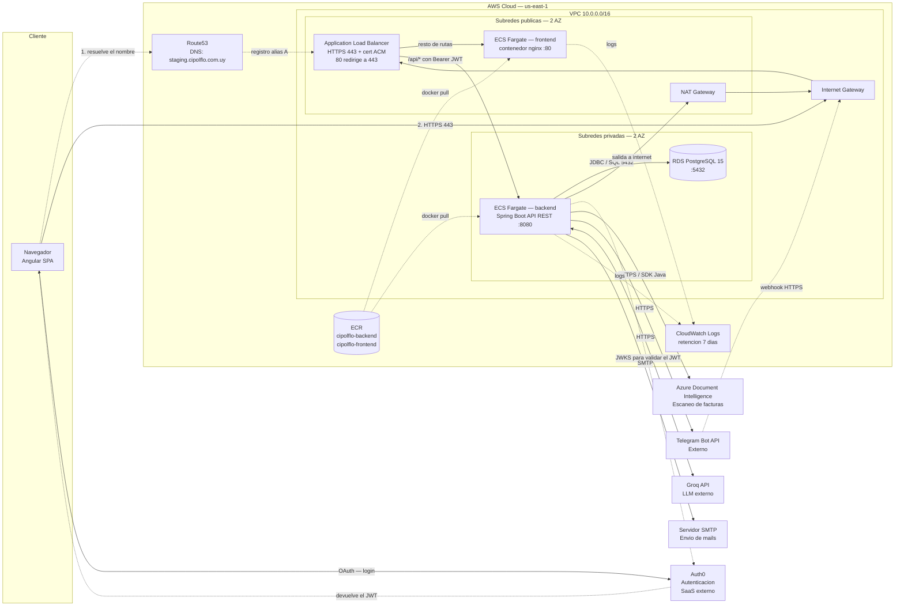
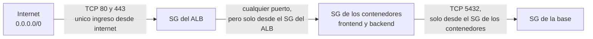

# Arquitectura de la infraestructura — CIPOLFLO

Este documento explica, en términos simples pero completos, cómo está armada la
infraestructura del proyecto **CIPOLFLO** en AWS. Cada componente incluye un
"¿qué es?" para entender los términos técnicos.

La referencia es el ambiente **staging** (`terraform/environments/staging/`):
es lo que está definido y desplegado hoy, y lo que describe este documento.
**Producción va a ser una copia de esto**, cambiando el dominio y su propio
certificado.

---

## La idea general

Tu app son dos programas separados: el **frontend** (lo que el usuario ve en el
navegador) y el **backend** (la lógica y los datos, que el frontend consulta).
Cada uno se "empaqueta" y corre en la nube de **AWS**. Toda la nube está
descrita en archivos de **Terraform**.

> **¿Qué es Terraform?** Es una herramienta de "infraestructura como código". En
> vez de crear los recursos a mano clickeando en la consola de AWS, los escribís
> en archivos de texto. Así podés crear, modificar o destruir toda la
> infraestructura con un comando, y queda versionado en git como cualquier
> código.

> **¿Qué es una imagen Docker / contenedor?** Una **imagen** es como una "caja
> sellada" que contiene tu programa más todo lo que necesita para correr
> (sistema, librerías, configuración). Un **contenedor** es esa caja ya en
> ejecución. La ventaja: corre igual en tu compu, en AWS o en cualquier lado,
> sin sorpresas de "en mi máquina andaba".

---

## Diagrama de despliegue



Puntos clave que el diagrama refleja y conviene no perder de vista:

- **No hay S3+CloudFront ni API Gateway.** El frontend es un contenedor que
  sirve la SPA, y el ruteo HTTPS lo hace el **ALB** (`/api/*` al backend, el
  resto al frontend).
- **No hay EC2.** Los dos contenedores corren en **ECS Fargate**.
- **El JWT lo valida el backend**, no un componente de red: Spring baja las
  claves públicas de Auth0 (`AUTH0_ISSUER_URI` / `AUTH0_AUDIENCE`).
- El backend está en subredes **privadas**: sale a internet por el **NAT
  Gateway**, y nadie de afuera lo alcanza salvo a través del ALB.

**Qué simplifica el diagrama** (para que se entienda, sin dejar de ser cierto):

- Las llamadas del backend a los servicios externos se dibujan directas, pero
  todas salen por el **NAT Gateway** y de ahí al Internet Gateway.
- Route53 aparece con flechas punteadas porque **no transporta tráfico**: solo
  traduce el nombre a la dirección del ALB antes de que empiece la conexión.
- El `docker pull` desde ECR lo hace la plataforma de Fargate al arrancar la
  tarea, no el contenedor ya en ejecución.
- No están dibujados los **security groups** (están en el diagrama de la
  sección 5) ni la plomería de red (tablas de ruteo, Elastic IP del NAT, grupo
  de subredes de RDS).

---

## 1. ¿Dónde viven las imágenes? → ECR

> **¿Qué es ECR (Elastic Container Registry)?** Es un "depósito de imágenes
> Docker" privado dentro de AWS. Pensalo como un Google Drive pero específico
> para guardar tus imágenes de contenedores. Solo tu cuenta puede subir y bajar
> de ahí.

Tenés dos repositorios:

- `cipolflo-backend` → la imagen de tu backend (Spring Boot / Java)
- `cipolflo-frontend` → la imagen de tu frontend

**El flujo:** construís la imagen en tu compu → la subís (`docker push`) a ECR →
AWS la baja desde ahí para ejecutarla. Siempre se usa el tag `:latest` (la
versión "más reciente").

📍 `terraform/modules/ecr/main.tf`

---

## 2. ¿Dónde se ejecutan? → ECS con Fargate

> **¿Qué es ECS (Elastic Container Service)?** Es el "director de orquesta" de
> AWS para contenedores. Vos le decís "quiero 1 contenedor del backend siempre
> corriendo" y ECS se encarga de levantarlo, vigilarlo y, si se cae, volver a
> levantarlo.

> **¿Qué es un cluster?** Es simplemente la **agrupación lógica** donde viven tus
> contenedores. Imaginalo como una "carpeta" o un "espacio de trabajo" que junta
> todos los servicios de tu proyecto bajo un mismo techo. El tuyo se llama
> `cipolflo-staging-cluster`.

> **¿Qué es Fargate?** Es el modo de ECS en el que **no manejás servidores**.
> Normalmente para correr un contenedor necesitarías una máquina virtual
> (encenderla, actualizarla, vigilar que no se llene). Con Fargate, AWS pone esa
> máquina por vos de forma invisible: vos solo te ocupás del contenedor. Más
> simple y sin mantenimiento.

> **¿Qué es una Task Definition?** Es la "receta" del contenedor: qué imagen
> usar, cuánta CPU y memoria, qué puerto abre y qué variables de entorno recibe.
> El **servicio** es lo que toma esa receta y mantiene corriendo la cantidad que
> pediste (en tu caso, 1 de cada uno).

| Servicio     | Imagen                     | Puerto | Dónde corre                          |
| ------------ | -------------------------- | ------ | ------------------------------------ |
| **backend**  | `cipolflo-backend:latest`  | 8080   | Subred **privada** (oculto a internet) |
| **frontend** | `cipolflo-frontend:latest` | 80     | Subred **pública**                   |

📍 `terraform/modules/ecs/main.tf`

---

## 3. La puerta de entrada → ALB y Route53

> **¿Qué es Route53?** Es el servicio de **DNS** de AWS. El DNS es la "agenda de
> contactos" de internet: traduce un nombre lindo
> (`staging.cipolflo.com.uy`) a la dirección técnica real del servidor. Cuando
> alguien escribe tu dominio en el navegador, Route53 lo manda al lugar correcto
> (tu Load Balancer).

> **¿Qué es el ALB (Application Load Balancer)?** Es el "recepcionista" de tu
> app: el único punto por donde entra todo el tráfico de internet. Hace dos
> trabajos clave:
>
> 1. **Maneja el HTTPS/seguridad**: tiene el certificado SSL (el candadito 🔒) y
>    si alguien entra por HTTP lo redirige a HTTPS automáticamente.
> 2. **Reparte el tráfico** según la dirección que pidieron (eso se llama
>    _routing_).

> **¿Qué es un certificado SSL / ACM?** El certificado es lo que habilita el
> `https://` y cifra la comunicación. **ACM (AWS Certificate Manager)** es donde
> AWS lo guarda y renueva gratis.

El camino completo de una petición:

```
Usuario (navegador)
      │  escribe https://staging.cipolflo.com.uy
      ▼
  Route53 (DNS)  →  "ese nombre vive en el Load Balancer"
      ▼
  ALB  [HTTPS 443, con certificado SSL]
      │   ¿qué URL pidió?
      ├── empieza con /api/*  ─────►  Contenedor BACKEND  (puerto 8080)
      │                                    │  consulta/guarda datos
      │                                    ▼
      │                               RDS PostgreSQL (puerto 5432)
      │
      └── cualquier otra cosa  ────►  Contenedor FRONTEND (puerto 80)
```

> **¿Qué es un health check?** Cada cierto intervalo el ALB consulta una
> dirección del contenedor para confirmar que sigue respondiendo. Si falla
> varias veces seguidas, deja de enviarle tráfico. El backend se verifica en
> `/actuator/health` (cada 60s, con 180s de gracia al arrancar, porque Spring
> Boot tarda en iniciar) y el frontend en `/` (cada 30s). Por eso, después de un
> despliegue, el servicio tarda un par de minutos en quedar disponible.

📍 ALB, target groups y la regla `/api/*` en `terraform/modules/alb/main.tf`
(recursos `aws_lb_listener_rule.backend` y `aws_lb_listener.https`).
El registro de DNS es `aws_route53_record.staging` en
`terraform/environments/staging/main.tf`.

---

## 4. La base de datos → RDS

> **¿Qué es RDS (Relational Database Service)?** Es PostgreSQL pero
> **administrado por AWS**. En vez de instalar y mantener vos la base de datos
> (backups, actualizaciones, etc.), AWS lo hace. Vos solo la usás.

- Motor: **PostgreSQL 15** | Instancia: `cipolflo-staging-db`
- Base: `CIPOLFLO_BD` | Usuario: `admin_staging`
- Vive en las **subredes privadas**: **no es accesible desde internet**, solo el
  backend puede hablarle.

📍 `terraform/modules/rds/main.tf`

---

## 5. La red → VPC, subredes, NAT, Security Groups

> **¿Qué es una VPC (Virtual Private Cloud)?** Es **tu red privada propia**
> dentro de AWS, aislada de las redes de los demás. Como tener tu propio
> "edificio" donde ubicás todas tus piezas y controlás quién entra y sale.

> **¿Qué son las subredes (subnets)?** Son "divisiones" dentro de tu red. Tenés
> dos tipos:
>
> - **Públicas**: tienen contacto directo con internet. Acá va el Load Balancer
>   y el frontend.
> - **Privadas**: no son alcanzables desde internet. Acá van el backend y la base
>   de datos (lo más sensible).
>
> Hay 2 de cada tipo, repartidas en dos **zonas de disponibilidad** (dos centros
> de datos físicos distintos), para que si una falla, la otra siga funcionando.

> **¿Qué es un Internet Gateway?** La "puerta principal" que conecta tus
> subredes **públicas** con internet (entrada y salida).

> **¿Qué es un NAT Gateway?** Una "puerta de salida de un solo sentido" para las
> subredes **privadas**. Permite que el backend salga a internet (por ejemplo, a
> bajar su imagen de ECR), pero **nadie de afuera puede entrar** por ahí.
> Seguridad sin aislamiento total.

> **¿Qué es un Security Group?** Es un **firewall** (cortafuegos) por cada pieza:
> define qué tráfico se permite. Lo importante es que las reglas no se escriben
> con direcciones IP sino **nombrando al grupo que puede entrar**, y eso forma
> una cadena: cada capa solo acepta conexiones de la anterior.



Leído al revés: **a la base solo le puede hablar un contenedor, y a un
contenedor solo le puede hablar el ALB**. Aunque alguien conociera la dirección
de la base de datos, no llegaría: no hay ninguna regla que le abra la puerta.

> Detalle: el grupo de la base **no tiene reglas de salida**, así que la RDS no
> puede iniciar conexiones hacia afuera. Los otros dos sí tienen salida abierta,
> que es lo que les permite bajar la imagen de ECR y llamar a los servicios
> externos.

📍 `terraform/modules/networking/main.tf`

---

## 6. Qué consume cada parte (variables y servicios externos)

> **¿Qué es una variable de entorno?** Un dato de configuración que le pasás al
> contenedor "desde afuera" cuando arranca (una contraseña, una URL, una clave
> de API). Así la misma imagen sirve para staging y para producción: cambia la
> configuración, no el programa.

**Backend** (task definition en `modules/ecs/main.tf`):

| Variable                                                        | Para qué sirve                                  |
| --------------------------------------------------------------- | ----------------------------------------------- |
| `SPRING_DATASOURCE_URL` / `_USERNAME` / `_PASSWORD`               | conectarse a la base RDS                        |
| `SPRING_PROFILES_ACTIVE` = `docker`                               | qué perfil de configuración usa Spring          |
| `AUTH0_ISSUER_URI`, `AUTH0_AUDIENCE`                              | validar los tokens de los usuarios              |
| `CORS_ALLOWED_ORIGINS`                                            | qué dominio puede llamar a la API               |
| `AZURE_DOCUMENT_INTELLIGENCE_ENDPOINT` / `_KEY`                   | escaneo de facturas                             |
| `MAIL_USERNAME`, `MAIL_PASSWORD`, `REPORTE_RESERVAS_DESTINATARIO` | envío de mails                                  |
| `TELEGRAM_BOT_TOKEN`, `TELEGRAM_WEBHOOK_SECRET`                   | bot de Telegram                                 |
| `AI_API_KEY`                                                      | modelo de lenguaje (LLM) externo                |

**Frontend**: `AUTH0_DOMAIN`, `AUTH0_CLIENT_ID`, `AUTH0_AUDIENCE` y
`BACKEND_URL`.

### Servicios externos

Ninguno de estos servicios está en AWS. Como el backend corre en subredes
privadas, los alcanza **saliendo por el NAT Gateway**.

> **Auth0 — login e identidad.** Servicio externo que maneja el registro, las
> contraseñas y los tokens de tus usuarios. El navegador hace el login contra
> Auth0 y recibe un **JWT** (una credencial firmada). Después manda ese token en
> cada pedido a la API, y **es el backend el que lo valida**: Spring se baja las
> claves públicas de Auth0 (`AUTH0_ISSUER_URI`) y verifica que la firma sea
> auténtica y que el token sea para esta app (`AUTH0_AUDIENCE`).

> **Azure Document Intelligence — escaneo de facturas.** Servicio de Microsoft
> (no de AWS) al que el backend le manda una factura y le devuelve los datos ya
> extraídos. Se usa desde Java con su SDK, por HTTPS.

> **Telegram — bot.** Acá el tráfico va en los dos sentidos: el backend le envía
> mensajes al bot por HTTPS, y Telegram **llama al backend** cuando un usuario
> le escribe (eso se llama _webhook_: en lugar de consultar periódicamente si
> hay novedades, el servicio externo avisa cuando ocurre algo). Ese pedido
> entrante llega por el ALB como cualquier otro, y el
> `TELEGRAM_WEBHOOK_SECRET` permite comprobar que efectivamente viene de
> Telegram y no de un tercero.

> **LLM externo (`AI_API_KEY`) y SMTP (mails).** Dos llamadas salientes más del
> backend, por HTTPS y SMTP respectivamente.

### CORS y logs

> **¿Qué es CORS?** Una regla de seguridad de los navegadores. Le dice al backend
> "solo aceptá pedidos que vengan desde tu propio dominio"
> (`staging.cipolflo.com.uy`), para que sitios ajenos no usen tu API.

> **¿Qué es CloudWatch?** El servicio de **logs y monitoreo** de AWS. Todo lo que
> imprimen tus contenedores queda guardado ahí (en tu caso, 7 días) para que
> puedas revisar errores. Grupos: `/ecs/cipolflo-staging-backend` y `-frontend`.

---

## 7. Tamaños, capacidad y costo

El dimensionamiento actual es el mínimo:

- **Contenedores**: 0.25 vCPU y 512 MB cada uno, con **una sola instancia** de
  cada servicio (`desired_count = 1`). Si una tarea falla, ECS la vuelve a
  levantar, pero durante ese lapso el servicio queda interrumpido: no hay
  redundancia ni escalado automático.
- **Base**: `db.t3.micro` con 20 GB, en una sola zona (sin Multi-AZ ni réplicas).
- **Logs**: se eliminan automáticamente a los 7 días.

> ⚠️ El **ALB** y el **NAT Gateway** se facturan por hora aunque la aplicación
> no reciba tráfico: son los recursos más caros del ambiente. Además hay **un
> solo NAT Gateway** (no uno por zona), así que aunque la red tenga 2 zonas de
> disponibilidad, la salida a internet de las subredes privadas es un punto
> único de falla.

---

## 8. Cómo se opera

### Dónde se guarda el estado de Terraform

> **¿Qué es el "estado"?** Un archivo donde Terraform registra qué recursos creó
> realmente en AWS, para saber después qué modificar o destruir. Si se pierde,
> Terraform deja de reconocer los recursos que había creado.

El estado **no se guarda localmente**: va a un bucket de S3
(`backend "s3"` en `environments/staging/main.tf`, con la clave
`staging/terraform.tfstate`). Como en el código no está escrito el nombre del
bucket, hay que pasárselo al inicializar:

```bash
cd terraform/environments/staging
terraform init -backend-config="bucket=NOMBRE-DEL-BUCKET"
terraform plan
terraform apply
```

### Los secretos

Las contraseñas y claves van en `terraform.tfvars`, que **está en `.gitignore`
y no se sube al repo**. Para trabajar en una máquina nueva, copiás
`terraform.tfvars.example`, lo renombrás a `terraform.tfvars` y lo completás.

> ⚠️ Hoy esos secretos terminan como **variables de entorno en texto plano**
> dentro de la task definition: se pueden leer desde la consola de ECS y quedan
> escritos en el archivo de estado. Es aceptable para un proyecto de este
> alcance, pero lo recomendable sería guardarlos en **AWS Secrets Manager** o
> **SSM Parameter Store** y que la task los lea de ahí.

### El rol de IAM

El módulo de ECS **no crea roles**: usa uno que ya existe, llamado `LabRole`,
porque es una cuenta de estudiante de AWS Academy y esas cuentas no permiten
crear roles propios. Si algún día esto se mueve a una cuenta normal de AWS, hay
que crear los roles de ejecución y de tarea y reemplazar ese `data` de
`modules/ecs/main.tf`.

### Desplegar una versión nueva del código

Como la imagen siempre se llama `:latest`, **Terraform no detecta el cambio**:
`terraform apply` no hace nada. Después de subir la imagen hay que forzar el
redespliegue del servicio en ECS:

```bash
# 1. login contra ECR
aws ecr get-login-password --region us-east-1 \
  | docker login --username AWS --password-stdin CUENTA.dkr.ecr.us-east-1.amazonaws.com

# 2. build + push
docker build -t cipolflo-backend .
docker tag cipolflo-backend:latest CUENTA.dkr.ecr.us-east-1.amazonaws.com/cipolflo-backend:latest
docker push CUENTA.dkr.ecr.us-east-1.amazonaws.com/cipolflo-backend:latest

# 3. forzar el redespliegue
aws ecs update-service --cluster cipolflo-staging-cluster \
  --service cipolflo-staging-backend --force-new-deployment
```

(Para el frontend es igual, cambiando `backend` por `frontend`.)

### Salidas (outputs)

Después del `apply`, `outputs.tf` muestra los datos que vas a necesitar:
`alb_dns_name` (la dirección del balanceador), las URLs de los dos repositorios
de ECR y `rds_endpoint` (la dirección de la base).

> 📁 Nota sobre el repo: los archivos `terraform/main.tf`, `variables.tf` y
> `outputs.tf` de la raíz están **vacíos**. La infraestructura real se levanta
> siempre desde `terraform/environments/<ambiente>/`.

---

## 9. Desarrollo local → docker-compose

> **¿Qué es docker-compose?** Una forma de levantar **varios contenedores juntos
> en tu propia compu** con un solo comando (`docker compose up`). Sirve para
> desarrollar sin gastar ni depender de AWS.

Levanta los mismos tres componentes localmente: Postgres + backend + frontend,
leyendo las variables de un archivo `.env` (que también está en `.gitignore`).

Diferencias con AWS que conviene tener presentes:

- La base es un **contenedor local**, no RDS, y se expone en el puerto **5433**
  para evitar conflictos con una instalación local de Postgres.
- **No hay ALB**: se accede directamente al frontend en `http://localhost`, sin
  HTTPS ni ruteo de `/api/*`.
- Al frontend local **no se le pasa `BACKEND_URL`** (en ECS sí), así que si el
  front depende de esa variable, hay que agregarla al `docker-compose.yml`.

---

## En una frase

> Empaquetás front y back como imágenes Docker → las guardás en **ECR** → corren
> como contenedores sin servidor en un **cluster de ECS/Fargate** → **Route53**
> dirige tu dominio al **ALB**, que los expone con HTTPS y manda `/api/*` al
> backend y el resto al frontend → el backend guarda datos en **RDS
> PostgreSQL** → todo encerrado en una **VPC** con subredes públicas/privadas,
> firewalls (**security groups**) y **Auth0** para el login.
